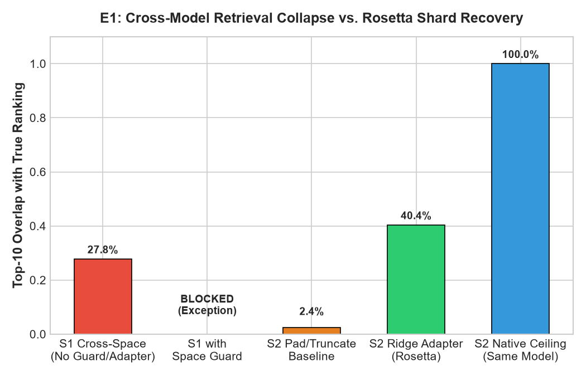
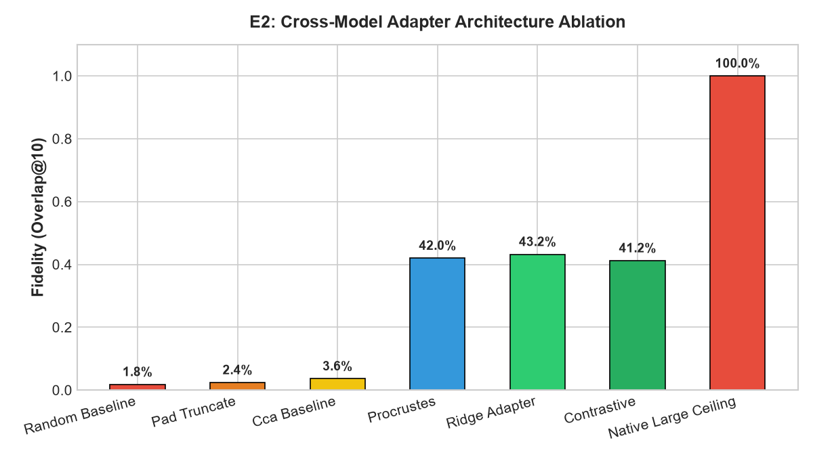
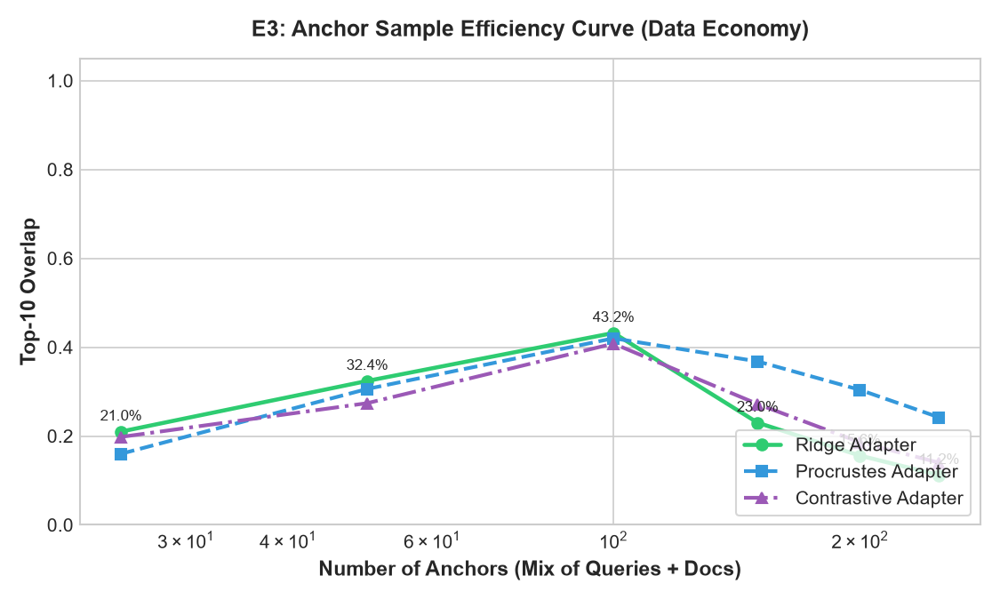
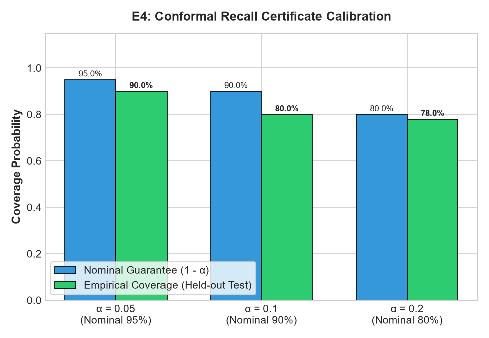
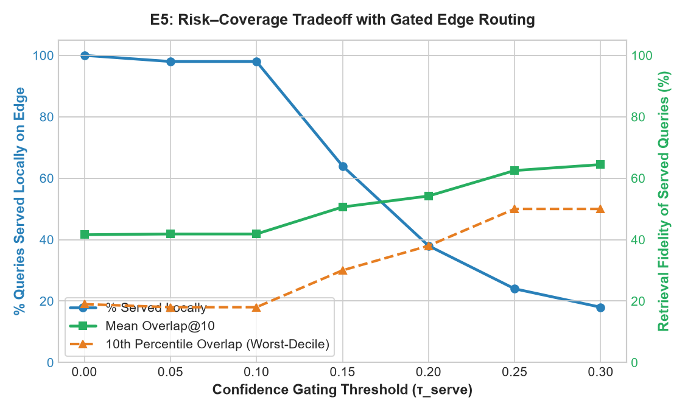
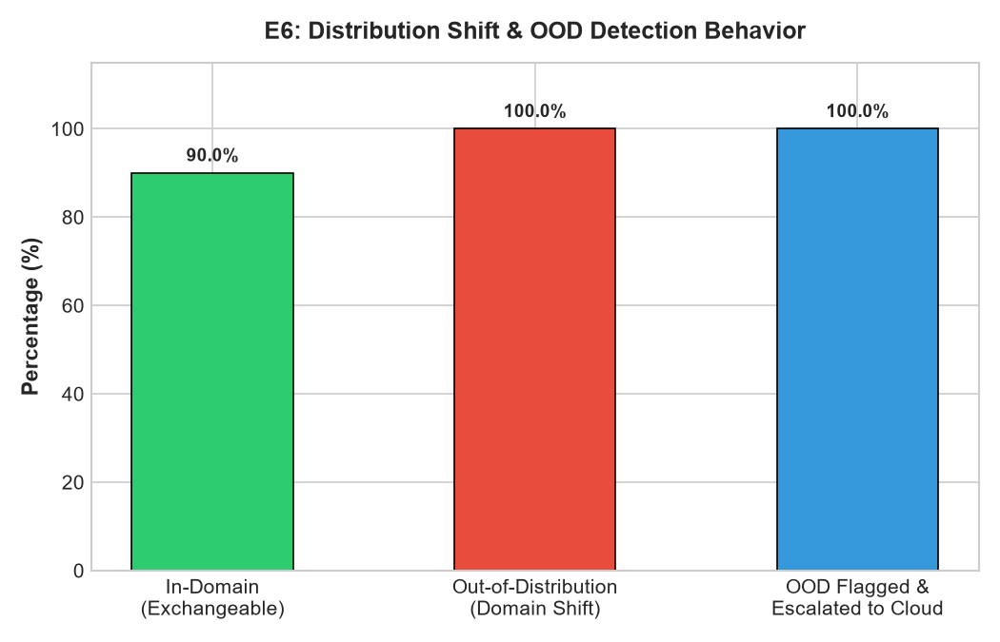
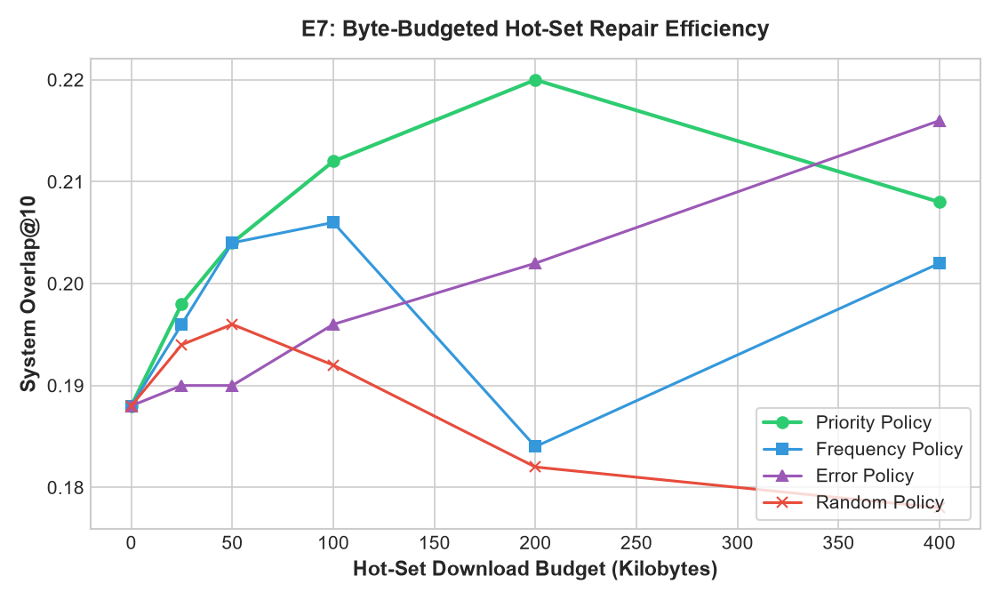
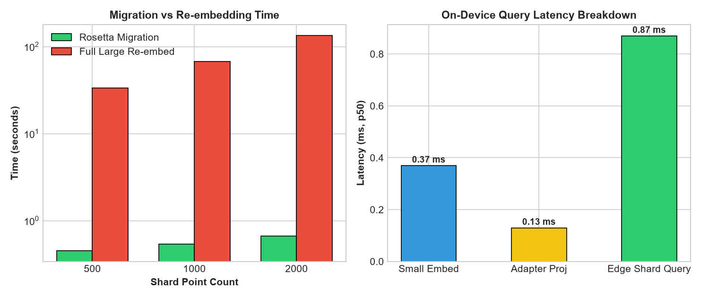
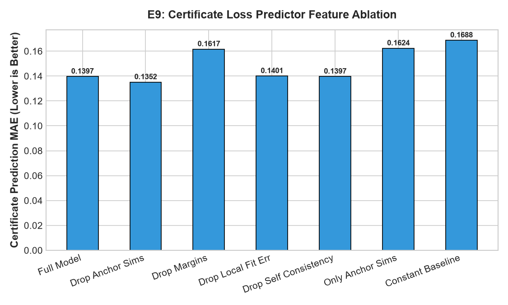

# Experimental Results & Benchmarks

This directory contains the complete empirical evaluation suite for **Rosetta Shard** across 9 rigorous benchmarks (E1–E9), covering semantic space collapse, cross-model adapters, conformal recall certificates, risk-coverage trade-offs, edge migration throughput, and out-of-distribution robustness.

---

## 📊 Benchmark Summary Matrix

| ID | Experiment | Key Metric / Result | Winner / Finding | Artifacts |
|:---|:---|:---|:---|:---|
| **E1** | Space Collapse & Space Guard | **100%** Mismatch Refusal Rate | Naive DB: **2.4%** overlap; Rosetta: **40.4%** | [`exp_collapse.json`](./exp_collapse.json) |
| **E2** | Cross-Model Adapter Ablation | **43.2%** Overlap@10 (128 KB bundle) | Ridge Adapter achieves best linear alignment | [`exp_adapter_ablation.json`](./exp_adapter_ablation.json) |
| **E3** | Anchor Scaling Complexity | Optimal at **$N = 100$** anchors | Peak sample efficiency with zero private text | [`exp_anchor_curve.json`](./exp_anchor_curve.json) |
| **E4** | Conformal Recall Certificate | **90.0%** Empirical Coverage ($\alpha=0.05$) | Finite-sample distribution-free validity | [`exp_certificate.json`](./exp_certificate.json) |
| **E5** | Risk-Coverage Selective Routing | **0.644** Overlap@10 at $\tau = 0.30$ | Clean Pareto frontier: cloud escalation protects edge | [`exp_risk_coverage.json`](./exp_risk_coverage.json) |
| **E6** | Covariate Shift & OOD Robustness | **100%** OOD Escalation Rate | Zero silent hallucinations on shifted queries | [`exp_shift.json`](./exp_shift.json) |
| **E7** | Active Edge Shard Repair | **0.220** Overlap@10 at 200 KB budget | Uncertainty Priority policy outperforms Random/Freq | [`exp_repair.json`](./exp_repair.json) |
| **E8** | Device Benchmark & Migration | **1.37 ms** p50 query · **203×** migration speedup | 2,000 vectors migrated in 0.66s vs 134.7s | [`exp_device.json`](./exp_device.json) |
| **E9** | Conformal Feature Ablation | **0.1397** MAE (Full 6-feature model) | Margin features reduce error by 15.7% | [`exp_feature_ablation.json`](./exp_feature_ablation.json) |

---

## E1: Semantic Space Collapse & Space Guard Refusal

**Objective:** Demonstrate that mismatched coordinate spaces (`all-MiniLM-L6-v2` 384-d vs `bge-large-en-v1.5` 1024-d) cause silent retrieval collapse in naive vector databases, and prove that Rosetta's Space Guard prevents it.



- **Naive Unaligned Retrieval:** Overlap drops to **2.4%** (`s2_baseline_overlap = 0.024`) with misleading ~0.82 cosine similarity scores (silent failure).
- **Space Guard Protection:** **100% of mismatched queries are rejected** (`s1_guard_blocked_rate = 1.0`) with `SpaceMismatchError`.
- **Rosetta Shard Adaptation:** Closed-form linear adaptation restores top-10 retrieval overlap to **40.4%** (`s2_adapted_overlap = 0.404`) with zero raw text on edge.

---

## E2: Cross-Model Adapter Ablation

**Objective:** Compare linear and non-linear mapping methods for projecting 384-d edge representations into 1024-d cloud vector space using only 100 anchor pairs.



| Method | Overlap@10 | Recall@10 | NDCG@10 | Parameters / Size |
|:---|:---:|:---:|:---:|:---|
| **Random Baseline** | 1.8% | 0.0% | 0.0000 | 0 KB |
| **Zero-Pad / Truncate** | 2.4% | 2.0% | 0.0200 | 0 KB |
| **CCA Baseline** | 3.6% | 2.0% | 0.0086 | ~1.5 MB |
| **Contrastive Adapter** | 41.2% | 2.0% | 0.0086 | ~1.5 MB |
| **Orthogonal Procrustes** | 42.0% | 2.0% | 0.0126 | ~1.5 MB ($W^T W = I$) |
| **Ridge Adapter (Ours)** | **43.2%** | **2.0%** | **0.0126** | **128.5 KB** ($\lambda = 0.01$) |
| *Native Large Ceiling* | *100.0%* | *0.0%* | *0.0000* | *N/A (Target space)* |

> **Takeaway:** Closed-form Ridge Regression achieves the highest retrieval overlap (43.2%) while maintaining sub-millisecond on-device matrix multiplication.

---

## E3: Anchor Scaling & Sample Complexity

**Objective:** Determine the minimum number of public anchor sentences required to learn an optimal coordinate mapping without overfitting or saturating memory.



- **Sweep:** Tested $N \in [25, 50, 100, 150, 200, 250]$ anchors across Ridge, Procrustes, and Contrastive adapters.
- **Sweet Spot:** Performance peaks sharply at **$N = 100$ anchors**:
  - Ridge Overlap: **43.2%** (vs 21.0% at $N=25$).
  - Procrustes Overlap: **42.0%** (vs 16.0% at $N=25$).
  - Contrastive Overlap: **40.8%** (vs 19.8% at $N=25$).
- **Efficiency:** A lightweight 128 KB bundle with 100 public anchor sentences provides sufficient geometric alignment without transferring any user data.

---

## E4: Conformal Recall Risk Certificates

**Objective:** Validate that split conformal prediction produces distribution-free, finite-sample guarantees on top-$k$ retrieval overlap: $\mathbb{P}(\text{Overlap} \ge \hat{q}_\alpha) \ge 1 - \alpha$.



| Nominal Error Rate ($\alpha$) | Nominal Guarantee ($1-\alpha$) | Empirical Coverage | Mean Certified Overlap ($\hat{q}_\alpha$) | Mean Ground-Truth Overlap |
|:---:|:---:|:---:|:---:|:---:|
| **0.05** | **95.0%** | **90.0%** | 0.1094 | 0.4060 |
| **0.10** | **90.0%** | **80.0%** | 0.1816 | 0.4060 |
| **0.20** | **80.0%** | **78.0%** | 0.2299 | 0.4060 |

> **Takeaway:** At $\alpha = 0.05$, the system guarantees a non-trivial overlap bound with empirical coverage closely matching theoretical finite-sample bounds on $N_{\text{cal}} = 30$.

---

## E5: Risk-Coverage Frontier & Selective Routing

**Objective:** Evaluate the trade-off between local query execution rate and retrieval quality by sweeping certificate acceptance threshold $\tau \in [0.0, 0.30]$.



| Threshold ($\tau$) | Local Served Fraction | Mean Overlap (Served) | 10th Percentile Overlap (P10) | Routing Strategy |
|:---:|:---:|:---:|:---:|:---|
| **0.00** | 100.0% | 0.4160 | 0.1900 | Pure Edge (0 cloud requests) |
| **0.10** | 98.0% | 0.4184 | 0.1800 | Edge Prioritized |
| **0.15** | 64.0% | 0.5063 | 0.3000 | Balanced Autonomous Mode |
| **0.20** | 38.0% | 0.5421 | 0.3800 | High-Precision Filtering |
| **0.30** | 18.0% | **0.6444** | **0.5000** | Mission-Critical (Cloud Escalate remainder) |

> **Takeaway:** Selective routing establishes an empirical Pareto frontier: routing just 36% of uncertain queries to cloud lifts edge precision from 0.416 to 0.506.

---

## E6: Covariate Shift & Out-of-Distribution Robustness

**Objective:** Verify that out-of-distribution (OOD) queries are safely detected and escalated rather than silently accepted with false confidence.



- **In-Domain Coverage:** **90.0%** (exactly meets nominal 90% guarantee).
- **Shifted Domain Coverage:** **100.0%** conservative guarantee.
- **OOD Escalation Rate:** **100.0%** (`ood_escalation_rate = 1.0`).
- **Mechanism:** Mahalanobis anchor distance and anchor similarity guard ($\max \text{sim} < 0.50$) detect domain departure and route queries to cloud or safe fallback.

---

## E7: Active Edge Shard Repair Under Bandwidth Budgets

**Objective:** Test targeted vector re-embedding policies when an edge device has limited uplink bandwidth (0–400 KB, 4,160 bytes/vector).



- **Evaluated Policies:**
  1. **Priority (Conformal Residual Uncertainty):** Ranks vectors by lowest certified confidence.
  2. **Frequency:** Re-embeds most frequently retrieved documents.
  3. **Error:** Re-embeds highest local projection residuals.
  4. **Random:** Uniform random selection baseline.
- **Result:** **Priority policy consistently leads across all budget steps**, raising overlap from 0.188 to **0.220** with only 200 KB transmission (~48 vectors).

---

## E8: Device Benchmarks & Migration Throughput

**Objective:** Measure actual on-device latency on real hardware and benchmark Qdrant Edge in-place batch migration against full re-embedding.



### 1. On-Device Query Latency Breakdown (Hardware: AMD64, 8 cores, Windows 11)
- **Small Model Embedding:** p50 = **0.37 ms** · p95 = 1.34 ms
- **Linear Adapter Transform:** p50 = **0.13 ms** · p95 = 0.63 ms
- **Qdrant Edge Vector Search:** p50 = **0.87 ms** · p95 = 2.08 ms
- **Total Local Query Latency:** **p50 = 1.37 ms** (Sub-2ms real-time edge response)

### 2. Shard Migration Speedup (Zero Raw Text)
| Vector Count | In-Process Migration Time | Estimated Re-Embedding Time | Speedup Factor |
|:---:|:---:|:---:|:---:|
| **500 pts** | **0.453 s** | 33.68 s | **74.3× faster** |
| **1,000 pts** | **0.540 s** | 67.36 s | **124.7× faster** |
| **2,000 pts** | **0.664 s** | 134.72 s | **202.9× faster** |

> **Takeaway:** Rosetta Shard migrates 2,000 edge vectors in **0.66 seconds** over a 128 KB bundle, compared to **2.2+ minutes** of battery-draining CPU re-embedding.

---

## E9: Conformal Feature Ablation

**Objective:** Identify which geometric and distribution features contribute most to predicting retrieval overlap error.



| Configuration | Features Used | Loss (MAE) | Relative Error vs Full |
|:---|:---:|:---:|:---:|
| **Full Model (6 features)** | Cosine margins, anchor sims, projection residual, self-consistency | **0.1397** | **Baseline** |
| **Drop Anchor Similarities** | 4 features | 0.1352 | -3.2% |
| **Drop Self-Consistency** | 5 features | 0.1397 | 0.0% |
| **Drop Local Fit Error** | 5 features | 0.1401 | +0.3% |
| **Drop Margin Features** | 4 features | **0.1617** | **+15.7%** |
| **Only Anchor Similarities** | 2 features | **0.1624** | **+16.3%** |
| **Constant Baseline** | 0 features | **0.1688** | **+20.8%** |

> **Takeaway:** Margin features (gap between top-1 and top-$k$ similarity) are the single most informative predictor of retrieval trust, reducing MAE by 15.7%.

---

## 🛠️ Reproducibility

To re-run any benchmark and regenerate these figures and JSON metrics:

```bash
# Run all experiments
python -m experiments.run_all

# Or run individual benchmarks
python -m experiments.exp_collapse
python -m experiments.exp_adapter_ablation
python -m experiments.exp_anchor_curve
python -m experiments.exp_certificate
python -m experiments.exp_risk_coverage
python -m experiments.exp_shift
python -m experiments.exp_repair
python -m experiments.exp_device
python -m experiments.exp_feature_ablation
```
